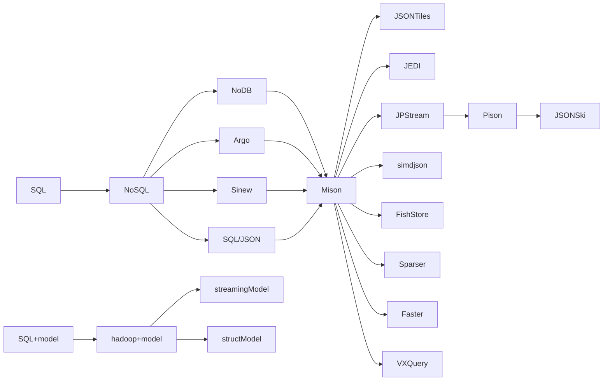

# JSON近期相关工作总结
## 相关论文

| year |  work name  |      会议    | 针对问题                                             | 值得关注的点       | 和哪些框架/开源项目实验对比         | 是否开源   |
| ---- | ----------- | -----------  | --------------------------------                    | -----------       | ---------------------------       | --        |
| 2023 | JSON SCHEMA | VLDB         | 以代数语言描述JSON SCHEMA                            | no mater          |                                   |
| 2022 | JSONSki     | ASPLOS       |                                                     | on                |                                   |
| 2022 | JSON Tiles  | SIGMOD       |                                                     | on                |                                   |
| 2022 | JEDI        | SIGMOD       |                                                     | on                |                                   |
| 2020 | Pison       | VLDB         |                                                     | off               |                                   |
| 2019 | JPStream    | ASPLOS       |                                                     | on                |                                   |
| 2019 | simdjson    | VLDB         |                                                     |                   |                                   |
| 2019 | FishStore   | SIGMOD       |                                                     | on                |                                   |
| 2018 | Sparser     | VLDB         |                                                     |                   |                                   |
| 2018 | Faster      | SIGMOD       |                                                     | on                |                                   |
| 2018 | VXQuery     | EDBT(B)      |                                                     | on                |                                   |
| 2017 | **Mison**   | VLDB         |                                                     |                   |                                   |
| 2014 | SQL/JSON    | SIGMOD       |                                                     | on                |                                   |
| 2014 | Sinew       | SIGMOD       |一些NoSQL数据库系统支持可以分析存储数据的原语 但为了发出SQL查询，用户必须预先定义一个模式 | 整体架构很清晰，采用了物理列/虚拟列转换的思路，偏移量表示属性 对多层嵌套处理乏力|MongoDB, a JSON extension of Postgres, RDBMS|
| 2013 | Argo        | WebDB(C)     |基于传统RDBMS，添加了一层JSON映射与查询语句Argo/SQL     | 将JSON转换为三元组和三张表 思路简单，不考虑多层JSON嵌套，可参考性一般|PostgreSQL, MongoDB, MySQL|
| 2012 | NoDB        | VLDB         |提出缩短从数据到查询的时间                             | 将数据处理从DBMS的思路拉出来 过于久远，无需对比                  | MySQL等DBMS                        | https://github.com/HBPMedical/PostgresRAW

## 工程项目

| year      | last update   |  work name    | 语言   | model    | web
| ----      | ---------     | ---------     | ----  | -----     | --
| 2022.4    | 2023.12       | fastjson2     | java  | struct    | https://github.com/alibaba/fastjson2
| 2018.3    | 2023.12       | JsonSurfer    | java  | streaming | https://github.com/wanglingsong/JsonSurfer
| 2015.4    | 2016.8        | RapidJSON     | C++   | struct    | https://github.com/Tencent/rapidjson
| 2015.5    | 2023.5        | fastjson      | java  | struct    | https://github.com/alibaba/fastjson
| 2012.4    | 2023.8        | json-c        | C     | struct    | https://github.com/json-c/json-c
| 2009.5    | 2023.11       | Jackson       | java  | struct    | https://github.com/FasterXML/jackson
| 2008.5    | 2023.1        | GSON          | java  | struct    | https://github.com/google/gson
$\color{red}{提供的功能}$

## NoDB in Action: Adaptive Query Processing on Raw Data --2012
* challenge：数据库体系的瓶颈在于加载数据到查询之间的时间，数据库具有外部表(external tables)特性，外部文件要求每个查询都访问整个原始数据文件。
* PostgresRaw不需要加载数据的过程，采用就地查询。
    * 多次查询的情况下，可视化系统索引和缓存结构的自适应变化

## Enabling JSON Document Stores in Relational Systems --2013
* challenge：支持JSON数据灵活性
* Argo/1

* Argo/3

<!-- Format:  -->

## Sinew: A SQL System for Multi-Structured Data --2014
* challenge：一些NoSQL数据库系统支持可以分析存储数据的原语，原语往往与SQL标准相距甚远，为了发出SQL查询，用户必须预先定义一个模式，以便在其上执行这些查询，如hadoop要求用户添加数据模式（该作者认为无需添加模式应当是NoSQL相比SQL的重要优势）
* 关键构件：关系存储层、目录、模式分析器、列物化器、加载器、查询重写器和反向文本索引。
    * 根据数据而不是用户输入自动向用户显示数据的逻辑视图
    
* 关系存储层
    * 作者认为当前RDBMS中有两种存储模式，物理列指逻辑视图中也作为物理列存储在数据库系统中的列（一个宽表，包含数据集中存在的每个唯一键的一列）$\color{blue}{处理稀疏数据集占据大量无效空间}$，虚拟列指逻辑视图中的列，在数据库系统中以原始键值对的序列化表示存储（一个单列表，每个对象的键值对序列化(作为文本或二进制)并存储在该列中(每行一个对象)）$\color{blue}{难以生成查询计划}$
    * 混合存储模式：为一些attributes $\color{blue}{常用的}$ 创建column，将剩余的 $\color{blue}{稀疏的、访问频率低的}$ 存储在一个序列化列中
* 目录

* 模式分析器、列物化器
    * 协同目录对行进行更新，物理与虚拟的实时转换
* Loader
    * 序列化：收集数据集中键的存在、类型和稀疏性信息，同步到目录
    * 插入：局限与列存储库，保持模块化
* 查询重写器
    * 根据SQL查询语句SQL COALESCE
* query
    * 文档结构与数据分离
    

## JSON Data Management – Supporting Schema-less Development in RDBMS --2014
* challenge：传统的RDBMS平台要求数据模式完整可存储、可查询和可索引，需要将面向模式的开发风格放宽，以支持无模式的开发风格。
* 